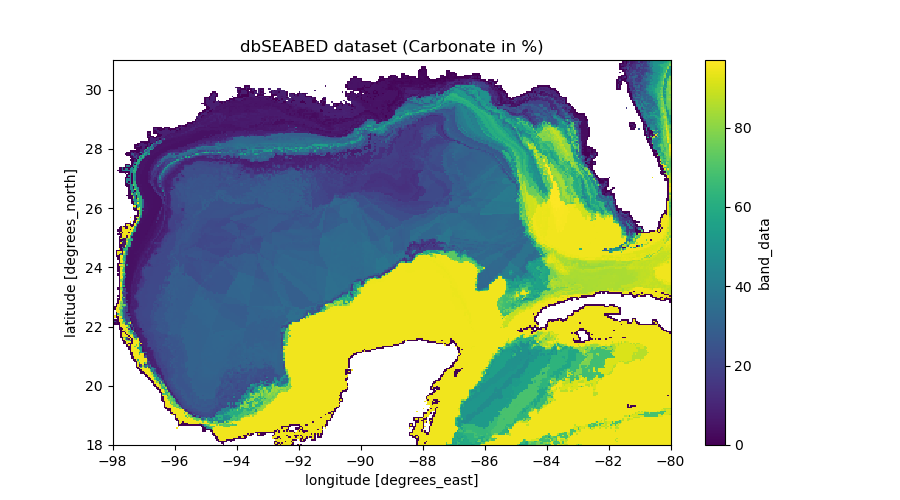

# bmi_dbseabed
[](https://bmi-dbseabed.readthedocs.io/en/latest/)
[](https://github.com/gantian127/bmi_dbseabed/blob/master/LICENSE.md)


bmi_dbseabed provides a set of functions that allow downloading of
the dataset from [dbSEABED](https://instaar.colorado.edu/~jenkinsc/dbseabed/),
a system for marine substrates datasets across the globe.
This system uses very large amounts of diverse observational data and
applies math methods to integrate/harmonize those
and produces gridded data on the major properties of the seabed.
The scope is the global ocean and across all depth zones.

The current page serves only the data for the Gulf of Mexico region.
The entire collection of data is available at
[this webpage](https://csdms.colorado.edu/wiki/Data:DBSEABED). Please note that
the data will be updated from time to time, approximately annually.

bmi_dbseabed also includes a [Basic Model Interface (BMI)](https://bmi.readthedocs.io/en/latest/),
which converts the dbSEABED datasets into a reusable,
plug-and-play data component ([pymt_dbseabed](https://pymt-dbseabed.readthedocs.io/)) for
the [PyMT](https://pymt.readthedocs.io/en/latest/?badge=latest) modeling framework developed
by Community Surface Dynamics Modeling System ([CSDMS](https://csdms.colorado.edu/wiki/Main_Page)).

If you have any suggestion to improve the current function, please create a github issue
[here](https://github.com/gantian127/bmi_dbseabed/issues).

### Install package

#### Stable Release

The bmi_dbseabed package and its dependencies can be installed with pip
```
$ pip install bmi_dbseabed
```
or with conda.
```
$ conda install -c conda-forge bmi_dbseabed
```
#### From Source

After downloading the source code, run the following command from top-level folder
to install bmi_dbseabed.
```
$ pip install -e .
```

### Quick Start
Below shows how to use two methods to download the datasets.

You can learn more details from the [tutorial notebook](notebooks/bmi_dbseabed.ipynb).

[//]: # (To run this notebook, please go to the [CSDMS EKT Lab]&#40;&#41;)

[//]: # (and follow the instruction in the "Lab notes" section.)

#### Example 1: use DbSeabed class to download data (Recommended method)

```python
import matplotlib.pyplot as plt
from bmi_dbseabed import DbSeabed

# get data from dbSEABED
dbseabed = DbSeabed()
data = dbseabed.get_data(
    var_name="carbonate",
    west=-98,
    south=18,
    east=-80,
    north=31,
    output="download.tif",
)

# show metadata
for key, value in dbseabed.metadata.items():
    print(f"{key}: {value}")


# plot data
data.plot(figsize=(9, 5))
plt.title("dbSEABED dataset (Carbonate in %)")
```



#### Example 2: use BmiDbSseabed class to download data (Demonstration of how to use BMI)

```python
import matplotlib.pyplot as plt
import numpy as np

from bmi_dbseabed import BmiDbSeabed


# initiate a data component
data_comp = BmiDbSeabed()
data_comp.initialize("config_file.yaml")

# get variable info
var_name = data_comp.get_output_var_names()[0]
var_unit = data_comp.get_var_units(var_name)
var_location = data_comp.get_var_location(var_name)
var_type = data_comp.get_var_type(var_name)
var_grid = data_comp.get_var_grid(var_name)

print(f"{var_name=} \n{var_unit=} \n{var_location=} \n{var_type=} \n{var_grid=}")

# get variable grid info
grid_rank = data_comp.get_grid_rank(var_grid)

grid_size = data_comp.get_grid_size(var_grid)

grid_shape = np.empty(grid_rank, int)
data_comp.get_grid_shape(var_grid, grid_shape)

grid_spacing = np.empty(grid_rank)
data_comp.get_grid_spacing(var_grid, grid_spacing)

grid_origin = np.empty(grid_rank)
data_comp.get_grid_origin(var_grid, grid_origin)

print(f"{grid_rank=} \n{grid_size=} \n{grid_shape=} \n{grid_spacing=} \n{grid_origin=}")

# get variable data
data = np.empty(grid_size, var_type)
data_comp.get_value(var_name, data)
data_2D = data.reshape(grid_shape)

# get X, Y extent for plot
min_y, min_x = grid_origin
max_y = min_y + grid_spacing[0] * (grid_shape[0] - 1)
max_x = min_x + grid_spacing[1] * (grid_shape[1] - 1)
dy = grid_spacing[0] / 2
dx = grid_spacing[1] / 2
extent = [min_x - dx, max_x + dx, min_y - dy, max_y + dy]

# plot data
fig, ax = plt.subplots(1, 1, figsize=(9, 5))
im = ax.imshow(data_2D, extent=extent)
fig.colorbar(im)
plt.xlabel("X")
plt.ylabel("Y")
plt.title("dbSEABED dataset (Carbonate in %)")

# finalize data component
data_comp.finalize()
```
